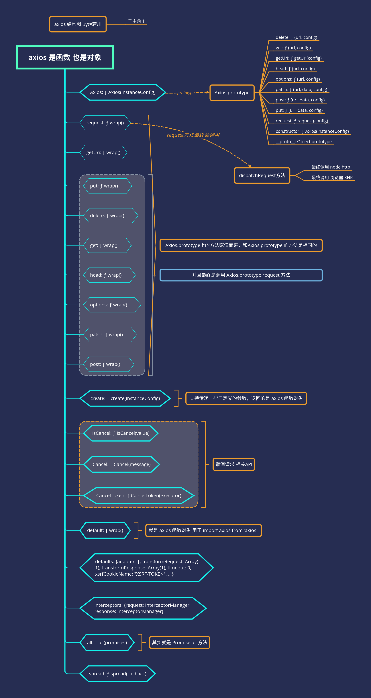

# 学习 axios 源码整体架构，打造属于自己的请求库

## 前言

>这是`学习源码整体架构系列`第六篇。整体架构这词语好像有点大，姑且就算是源码整体结构吧，主要就是学习是代码整体结构，不深究其他不是主线的具体函数的实现。本篇文章学习的是实际仓库的代码。

`学习源码整体架构系列`文章如下：
>1.[学习 jQuery 源码整体架构，打造属于自己的 js 类库](https://juejin.im/post/5d39d2cbf265da1bc23fbd42)<br>
>2.[学习 underscore 源码整体架构，打造属于自己的函数式编程类库](https://juejin.im/post/5d4bf94de51d453bb13b65dc)<br>
>3.[学习 lodash 源码整体架构，打造属于自己的函数式编程类库](https://juejin.im/post/5d767e1d6fb9a06b032025ea)<br>
>4.[学习 sentry 源码整体架构，打造属于自己的前端异常监控SDK](https://juejin.im/post/5dba5a39e51d452a2378348a)<br>
>5.[学习 vuex 源码整体架构，打造属于自己的状态管理库](https://juejin.im/post/5dd4e61a6fb9a05a5c010af0)<br>

感兴趣的读者可以点击阅读。下一篇可能是学习 `axios` 源码。

TODO:
**导读**<br>

本文学习的版本是`v0.19.0`。克隆的官方仓库的`master`分支。
截至目前（2019年12月），最新一次`commit`是`a17c70cb5ae4acd7`，`Fix CI build failure (#2570)`。

本文仓库在这里[若川的 axios-analysis github 仓库](https://github.com/lxchuan12/axios-analysis)。求个`star`呀。

TODO: 提问

4.怎么实现
5.简述 `axios` 流程

axios-analysis


## chrome 和 vscode  调试 axios 源码方法

前不久，笔者在知乎回答了一个问题[一年内的前端看不懂前端框架源码怎么办？](https://www.zhihu.com/question/350289336/answer/910970733)
主要有四点：<br>
>1.借助调试<br>
>2.搜索查阅相关高赞文章<br>
>3.把不懂的地方记录下来，查阅相关文档<br>
>4.总结<br>

看源码，调试很重要，所以笔者写下 `axios` 源码调试方法，帮助一些可能不知道如何调试的读者。

### chrome 调试浏览器环境 的 axios

调试方法

`axios`打包后有`sourcemap`文件。

```bash
# 可以克隆笔者的这个仓库代码
git clone https://github.com/lxchuan12/axios-analysis.git
cd axios-analaysis/axios
npm install
npm start
# open [http://localhost:3000](http://localhost:3000)
# chrome F12 source 控制面板  webpack//   .  lib 目录下，根据情况自行断点调试
```

### vscode 调试 node 环境的 axios

在根目录下 `axios-analysis/`
创建`.vscode/launch`文件如下：

```json
{
    // 使用 IntelliSense 了解相关属性。
    // 悬停以查看现有属性的描述。
    // 欲了解更多信息，请访问: https://go.microsoft.com/fwlink/?linkid=830387
    "version": "0.2.0",
    "configurations": [
        {
            "type": "node",
            "request": "launch",
            "name": "Launch Program",
            "program": "${workspaceFolder}/axios/sandbox/client.js",
            "skipFiles": [
                "<node_internals>/**"
            ]
        },
    ]
}
```

按`F5`开始调试即可，按照自己的情况，单步跳过`（F10）`、单步调试`（F11）`断点调试。

## 先看 axios 结构是怎样的

```bash
git clone https://github.com/lxchuan12/axios-analysis.git
cd axios-analaysis/axios
npm install
npm start
```

按照上文说的调试方法，` npm start `后，直接在 `chrome` 浏览器中调试。
打开 http://localhost:3000，在控制台打印出`axios`，估计很多人都没打印出来看过。

```js
console.log({axios: axios});
```

层层点开来看，`axios` 的结构是怎样的，先有一个大概印象。

笔者画了一张图表示。



看完结构图，接下来看具体源码的实现。可以跟着断点调试一下。

**断点调试要领：**<br>
**赋值语句可以一步跳过，看返回值即可，后续详细再看。**<br>
**函数执行需要断点跟着看，也可以结合注释和上下文倒推这个函数做了什么。**<br>

## axios 原理

## axios 源码 初始化

看源码第一步，先看`package.json`。一般都会申明`main`主入口文件。

```json
// package.json
{
  "name": "axios",
  "version": "0.19.0",
  "description": "Promise based HTTP client for the browser and node.js",
  "main": "index.js",
  // ...
}
```

主入口文件

```js
// index.js
module.exports = require('./lib/axios');
```

### `lib/axios.js`主文件

`axios.js`文件 代码相对比较多。分为三部分展开叙述。

>1. 第一部分：引入一些工具函数`utils`、`Axios`构造函数、默认配置`defaults`等。<br>
>2. 第二部分：是生成实例对象 `axios`、`axios.Axios`、`axios.create`等<br>
>3. 第三部分取消相关API实现，还有`all`、`spread`、导出等实现。<br>

#### 第一部分

引入一些工具函数`utils`、`Axios`构造函数、默认配置`defaults`等。

```js
// 第一部分：
// lib/axios
// 严格模式
'use strict';
// 引入 utils 对象，有很多工具方法。
var utils = require('./utils');
// 引入 bind 方法
var bind = require('./helpers/bind');
// 构造函数 Axios 核心
var Axios = require('./core/Axios');
// 合并配置方法
var mergeConfig = require('./core/mergeConfig');
// 引入默认配置
var defaults = require('./defaults');
```

#### 第二部分

是生成实例对象 `axios`、`axios.Axios`、`axios.create`等

```js
/**
 * Create an instance of Axios
 *
 * @param {Object} defaultConfig The default config for the instance
 * @return {Axios} A new instance of Axios
 */
function createInstance(defaultConfig) {
  var context = new Axios(defaultConfig);
  var instance = bind(Axios.prototype.request, context);

  // Copy axios.prototype to instance
  utils.extend(instance, Axios.prototype, context);

  // Copy context to instance
  utils.extend(instance, context);

  return instance;
}

// Create the default instance to be exported
// 导出 创建默认实例
var axios = createInstance(defaults);

// Expose Axios class to allow class inheritance
// 暴露 Axios class 允许 class 继承 也就是可以 new axios.Axios()
axios.Axios = Axios;

// Factory for creating new instances
// 工厂模式 创建新的实例 用户可以自定义一些参数
axios.create = function create(instanceConfig) {
  return createInstance(mergeConfig(axios.defaults, instanceConfig));
};
```

看完第二部分，里面涉及几个工具函数，如`bind`、`extend`。接下来讲述这几个工具方法。

#### 工具方法之 bind

`./helpers/bind`

```js
'use strict';
// 返回一个新的函数 wrap 
module.exports = function bind(fn, thisArg) {
  return function wrap() {
    var args = new Array(arguments.length);
    for (var i = 0; i < args.length; i++) {
      args[i] = arguments[i];
    }
    return fn.apply(thisArg, args);
  };
};
```

传递两个参数函数和`thisArg`指向。
把参数`arguments`生成数组，最后调用返回参数结构。

#### 工具方法之 utils.extend

```js
/**
 * Extends object a by mutably adding to it the properties of object b.
 *
 * @param {Object} a The object to be extended
 * @param {Object} b The object to copy properties from
 * @param {Object} thisArg The object to bind function to
 * @return {Object} The resulting value of object a
 */
function extend(a, b, thisArg) {
  forEach(b, function assignValue(val, key) {
    if (thisArg && typeof val === 'function') {
      a[key] = bind(val, thisArg);
    } else {
      a[key] = val;
    }
  });
  return a;
}
```

#### 工具方法之 utils.forEach

遍历数组和对象。设计模式称之为迭代器模式。很多源码都有类似这样的遍历函数。比如大家熟知的`jQuery` `$.each`。

```js
/**
 * @param {Object|Array} obj The object to iterate
 * @param {Function} fn The callback to invoke for each item
 */
function forEach(obj, fn) {
  // Don't bother if no value provided
  if (obj === null || typeof obj === 'undefined') {
    return;
  }

  // Force an array if not already something iterable
  if (typeof obj !== 'object') {
    /*eslint no-param-reassign:0*/
    obj = [obj];
  }

  if (isArray(obj)) {
    // Iterate over array values
    for (var i = 0, l = obj.length; i < l; i++) {
      fn.call(null, obj[i], i, obj);
    }
  } else {
    // Iterate over object keys
    for (var key in obj) {
      if (Object.prototype.hasOwnProperty.call(obj, key)) {
        fn.call(null, obj[key], key, obj);
      }
    }
  }
}
```

#### 第三部分

取消相关API实现，还有`all`、`spread`、导出等实现。

```js
// Expose Cancel & CancelToken
// 导出 Cancel 和 CancelToken
axios.Cancel = require('./cancel/Cancel');
axios.CancelToken = require('./cancel/CancelToken');
axios.isCancel = require('./cancel/isCancel');

// Expose all/spread
// 导出 all 和 spread API
axios.all = function all(promises) {
  return Promise.all(promises);
};
axios.spread = require('./helpers/spread');

module.exports = axios;

// Allow use of default import syntax in TypeScript
// 也就是可以以下方式引入
// import axios from 'axios';
module.exports.default = axios;
```

这里介绍下 `spread`，取消的`API`暂时不做分析。

假设你有这样的需求。

```js
 function f(x, y, z) {}
 var args = [1, 2, 3];
 f.apply(null, args);
```

那么可以用`spread`方法。用法：

```js
axios.spread(function(x, y, z) {})([1, 2, 3]);
```

实现也比较简单。源码实现：

```js
/**
 * @param {Function} callback
 * @returns {Function}
 */
module.exports = function spread(callback) {
  return function wrap(arr) {
    return callback.apply(null, arr);
  };
};
```

上文`var context = new Axios(defaultConfig);`

### Axios

`lib/core/Axios.js`

构造函数`Axios`。

```js
function Axios(instanceConfig) {
  this.defaults = instanceConfig;
  this.interceptors = {
    request: new InterceptorManager(),
    response: new InterceptorManager()
  };
}
```

```js
Axios.prototype.request = function(config){
  // 省略，这个是核心方法，后文结合例子详细描述
  // code ...
  var promise = Promise.resolve(config);
  // code ...
  return promise;
}
Axios.prototype.getUri = function(){}
// 提供一些请求方法的别名
// Provide aliases for supported request methods
// 遍历执行
utils.forEach(['delete', 'get', 'head', 'options'], function forEachMethodNoData(method) {
  /*eslint func-names:0*/
  Axios.prototype[method] = function(url, config) {
    return this.request(utils.merge(config || {}, {
      method: method,
      url: url
    }));
  };
});

utils.forEach(['post', 'put', 'patch'], function forEachMethodWithData(method) {
  /*eslint func-names:0*/
  Axios.prototype[method] = function(url, data, config) {
    return this.request(utils.merge(config || {}, {
      method: method,
      url: url,
      data: data
    }));
  };
});

module.exports = Axios;
```

### InterceptorManager 拦截器管理构造函数

请求前拦截，和请求后拦截。<br>
在`Axios.prototype.request`函数里使用，具体怎么实现的拦截的，后文详细讲述。<br>

[axios github 仓库 拦截器文档](https://github.com/axios/axios#interceptors)

如何使用：

```js
// Add a request interceptor
// 添加请求前拦截器
axios.interceptors.request.use(function (config) {
  // Do something before request is sent
  return config;
}, function (error) {
  // Do something with request error
  return Promise.reject(error);
});

// Add a response interceptor
// 添加请求后拦截器
axios.interceptors.response.use(function (response) {
  // Any status code that lie within the range of 2xx cause this function to trigger
  // Do something with response data
  return response;
}, function (error) {
  // Any status codes that falls outside the range of 2xx cause this function to trigger
  // Do something with response error
  return Promise.reject(error);
});
```

如果用完拦截器想移除，用`eject`方法。

```js
const myInterceptor = axios.interceptors.request.use(function () {/*...*/});
axios.interceptors.request.eject(myInterceptor);
```

拦截器也可以添加自定义的实例上。

```js
const instance = axios.create();
instance.interceptors.request.use(function () {/*...*/});
```

源码实现：

构造函数，`handles` 存储拦截器函数。

```js
function InterceptorManager() {
  this.handlers = [];
}
```

接下来声明了三个方法：使用、移除、遍历。

#### InterceptorManager.prototype.use

传递两个函数作为参数，返回数字 ID，用于移除拦截器

```js
/**
 * @param {Function} fulfilled The function to handle `then` for a `Promise`
 * @param {Function} rejected The function to handle `reject` for a `Promise`
 *
 * @return {Number} An ID used to remove interceptor later
 */
InterceptorManager.prototype.use = function use(fulfilled, rejected) {
  this.handlers.push({
    fulfilled: fulfilled,
    rejected: rejected
  });
  return this.handlers.length - 1;
};
```

#### InterceptorManager.prototype.eject

根据 use 返回的 ID 移除 拦截器

```js
/**
 * @param {Number} id The ID that was returned by `use`
 */
InterceptorManager.prototype.eject = function eject(id) {
  if (this.handlers[id]) {
    this.handlers[id] = null;
  }
};
```

#### InterceptorManager.prototype.forEach

遍历执行 拦截器

```js
/**
 * @param {Function} fn The function to call for each interceptor
 */
InterceptorManager.prototype.forEach = function forEach(fn) {
  utils.forEach(this.handlers, function forEachHandler(h) {
    if (h !== null) {
      fn(h);
    }
  });
};
```

## 实例结合

上文叙述的调试时运行`npm start` 是用`axios/sandbox/client.html`路径的文件作为示例的。

以下是一段这个文件中的代码。

```js
axios(options)
.then(function (res) {
  response.innerHTML = JSON.stringify(res.data, null, 2);
})
.catch(function (res) {
  response.innerHTML = JSON.stringify(res.data, null, 2);
});
```

### 先看调用栈流程

如果不想一步步调试，有个偷巧的方法。<br>
知道 `axios` 使用了`XMLHttpRequest`。<br>
可以在项目中搜索：`new XMLHttpRequest`。<br>
定位到文件 `axios/lib/adapters/xhr.js`<br>
在这条语句 `var request = new XMLHttpRequest();`<br>
`chrome` 浏览器中 打个断点调试下，再根据调用栈来细看具体函数等实现。<br>

`Call Stack`

```bash
dispatchXhrRequest (xhr.js:19)
xhrAdapter (xhr.js:12)
dispatchRequest (dispatchRequest.js:60)
Promise.then (async)
request (Axios.js:54)
wrap (bind.js:10)
submit.onclick ((index):138)
```

简述下流程：<br>
1. `Send Request` 按钮点击 `submit.onclick`<br>
2. 调用 `axios` 函数实际上是调用 `Axios.prototype.request` 函数，而这个函数使用 `bind` 返回的一个名为`wrap`的函数。<br>
3. 调用 `Axios.prototype.request`<br>
4. 执行拦截器 dispatchRequest<br>
5. dispatchRequest 之后调用 adapter (xhrAdapter)<br>
6. 最后调用 dispatchXhrRequest<br>

如果仔细看了文章开始的`axios 结构关系图`，其实对这个流程也有大概的了解。

接下来看 `Axios.prototype.request` 具体实现。

### Axios.prototype.request 请求核心方法

```js
Axios.prototype.request = function request(config) {
  /*eslint no-param-reassign:0*/
  // Allow for axios('example/url'[, config]) a la fetch API
  // 这一段代码 其实就是 使 axios('lxchuan12.cn', [, config])
  // config 参数可以省略
  if (typeof config === 'string') {
    config = arguments[1] || {};
    config.url = arguments[0];
  } else {
    config = config || {};
  }

  // 合并默认参数和用户传递的参数
  config = mergeConfig(this.defaults, config);

  // Set config.method
  // 设置 请求方法，默认 get 。
  if (config.method) {
    config.method = config.method.toLowerCase();
  } else if (this.defaults.method) {
    config.method = this.defaults.method.toLowerCase();
  } else {
    config.method = 'get';
  }
  // Hook up interceptors middleware
  // 这段拆开到后文再讲述
};
```

```js
  // Hook up interceptors middleware
  var chain = [dispatchRequest, undefined];
  var promise = Promise.resolve(config);

  this.interceptors.request.forEach(function unshiftRequestInterceptors(interceptor) {
    chain.unshift(interceptor.fulfilled, interceptor.rejected);
  });

  this.interceptors.response.forEach(function pushResponseInterceptors(interceptor) {
    chain.push(interceptor.fulfilled, interceptor.rejected);
  });

  while (chain.length) {
    promise = promise.then(chain.shift(), chain.shift());
  }

  return promise;
```

这段代码相对比较绕，但其实也容易懂，笔者画了一张图表示TODO:。最后会调用`dispatchRequest`方法。

### dispatchRequest 最终派发请求

```js
'use strict';

var utils = require('./../utils');
var transformData = require('./transformData');
var isCancel = require('../cancel/isCancel');
var defaults = require('../defaults');

/**
 * Throws a `Cancel` if cancellation has been requested.
 */
function throwIfCancellationRequested(config) {
  if (config.cancelToken) {
    config.cancelToken.throwIfRequested();
  }
}

/**
 * Dispatch a request to the server using the configured adapter.
 *
 * @param {object} config The config that is to be used for the request
 * @returns {Promise} The Promise to be fulfilled
 */
module.exports = function dispatchRequest(config) {
  throwIfCancellationRequested(config);

  // Ensure headers exist
  // 确保 headers 存在
  config.headers = config.headers || {};

  // Transform request data
  // 转换请求的数据
  config.data = transformData(
    config.data,
    config.headers,
    config.transformRequest
  );

  // Flatten headers
  // 拍平 headers
  config.headers = utils.merge(
    config.headers.common || {},
    config.headers[config.method] || {},
    config.headers || {}
  );

  // 以下这些方法 删除 headers
  utils.forEach(
    ['delete', 'get', 'head', 'post', 'put', 'patch', 'common'],
    function cleanHeaderConfig(method) {
      delete config.headers[method];
    }
  );
  // adapter 适配器部分 拆开 放在下文讲
};
```

#### transformData 转换数据

上文的代码里有个函数 `transformData` ，这里解释下。其实就是遍历传递的函数数组 对数据操作，最后返回数据。

```js
module.exports = function transformData(data, headers, fns) {
  /*eslint no-param-reassign:0*/
  utils.forEach(fns, function transform(fn) {
    data = fn(data, headers);
  });

  return data;
};
```

适配器，在设计模式中称之为适配器模式。讲个生活中简单的例子，大家就容易理解。

我们常用以前手机耳机孔都是圆孔，而现在基本是耳机孔和充电接口合二为一。统一为`typec`。

这时我们需要需要一个`typec转圆孔的转接口`，这就是适配器。

```js
  // adapter 适配器部分
  var adapter = config.adapter || defaults.adapter;

  return adapter(config).then(function onAdapterResolution(response) {
    throwIfCancellationRequested(config);

    // Transform response data
    // 转换响应的数据
    response.data = transformData(
      response.data,
      response.headers,
      config.transformResponse
    );

    return response;
  }, function onAdapterRejection(reason) {
    if (!isCancel(reason)) {
      throwIfCancellationRequested(config);

      // Transform response data
      // 转换响应的数据
      if (reason && reason.response) {
        reason.response.data = transformData(
          reason.response.data,
          reason.response.headers,
          config.transformResponse
        );
      }
    }

    return Promise.reject(reason);
  });
```

### adapter 适配器 真正发送请求

```js
var adapter = config.adapter || defaults.adapter;
```

看了上文的 `adapter`，可以知道支持用户自定义。比如可以通过微信小程序 `wx.request`的 也写一个 `adapter`。<br>
接着来看下 `defaults.ddapter`。<br>
文件路径：`axios/lib/defaults.js`

根据当前环境引入，如果是浏览器环境引入`xhr`，是`node`环境则引入`http`。<br>
类似判断`node`环境，也在[`sentry-javascript`](https://github.com/getsentry/sentry-javascript)源码中有看到。<br>

```js
function getDefaultAdapter() {
  var adapter;
  if (typeof XMLHttpRequest !== 'undefined') {
    // For browsers use XHR adapter
    adapter = require('./adapters/xhr');
  } else if (typeof process !== 'undefined' && Object.prototype.toString.call(process) === '[object process]') {
    // For node use HTTP adapter
    adapter = require('./adapters/http');
  }
  return adapter;
}
var defaults = {
  adapter: getDefaultAdapter(),
  // ...
};
```

可以发现

`xhr`

接下来就是我们熟悉的 `XMLHttpRequest` 对象。

可能读者不了解可以参考[XMLHttpRequest MDN 文档](https://developer.mozilla.org/zh-CN/docs/Web/API/XMLHttpRequest)。

这块代码有删减，具体可以看[axios 仓库 xhr.js](https://github.com/axios/axios/blob/master/lib/adapters/xhr.js)，也可以克隆我的`axios-analysis`仓库调试时具体分析。

```js
module.exports = function xhrAdapter(config) {
  return new Promise(function dispatchXhrRequest(resolve, reject) {
    // 这块代码有删减
    var request = new XMLHttpRequest();
    request.open()
    request.timeout = config.timeout;
    // 监听 state 改变
    request.onreadystatechange = function handleLoad() {
      if (!request || request.readyState !== 4) {
        return;
      }
      // ...
    }
    // 取消
    request.onabort = function(){};
    // 错误
    request.onerror = function(){};
    // 超时
    request.ontimeout = function(){};
    // cookies 跨域携带 cookies 面试官常喜欢考这个
    // 一个布尔值，用来指定跨域 Access-Control 请求是否应带有授权信息，如 cookie 或授权 header 头。
    // Add withCredentials to request if needed
    if (config.withCredentials) {
      request.withCredentials = true;
    }

    // 上传下载进度相关
    // Handle progress if needed
    if (typeof config.onDownloadProgress === 'function') {
      request.addEventListener('progress', config.onDownloadProgress);
    }

    // Not all browsers support upload events
    if (typeof config.onUploadProgress === 'function' && request.upload) {
      request.upload.addEventListener('progress', config.onUploadProgress);
    }

    // Send the request
    // 发送请求
    request.send(requestData);
  });
}
```

而实际上现在 [`fetch`](https://developer.mozilla.org/zh-CN/docs/Web/API/Fetch_API/Using_Fetch) 支持的很好了，阿里开源的 [umi-request](https://github.com/umijs/umi-request/blob/master/README_zh-CN.md) 请求库，就是用`fetch`封装的，而不是用`XMLHttpRequest`。
最后总结时，大概讲述下 `umi-request` 和 `axios` 的区别。

`http`

```js
module.exports = function httpAdapter(config) {
  return new Promise(function dispatchHttpRequest(resolvePromise, rejectPromise) {
  });
};
```

## 流程图

文章写到这里就基本到接近尾声了。最后画张图总结下 `axios` 流程。TODO:

## 总结

`Axios` 源码相对不多，打包后一千多行，比较容易看完，非常值得学习。

[KoAJAX](https://github.com/EasyWebApp/KoAJAX)
[umi-request](https://github.com/umijs/umi-request/blob/master/README_zh-CN.md)

TODO:

[若川的 axios-analysis github 仓库](https://github.com/lxchuan12/axios-analysis)<br>

如果读者发现有不妥或可改善之处，再或者哪里没写明白的地方，欢迎评论指出。另外觉得写得不错，对您有些许帮助，可以点赞、评论、转发分享，也是对笔者的一种支持，非常感谢呀。

## 推荐阅读

[官方axios github 仓库](https://github.com/axios/axios)<br>

写文章前，搜索了以下几篇文章泛读了一下。看懂了我这篇的基础上，有兴趣在对比看看以下这几篇，看起来也快。

[@叫我小明呀：Axios 源码解析](https://juejin.im/post/5cb5d9bde51d456e62545abc)<br>
[@尼库尼库桑：深入浅出 axios 源码](https://zhuanlan.zhihu.com/p/37962469)<br>
[@小贼先生_ronffy：Axios源码深度剖析 - AJAX新王者](https://juejin.im/post/5b0ba2d56fb9a00a1357a334)<br>
[逐行解析Axios源码](https://juejin.im/post/5d501512518825159e3d7be6)<br>
[[译]axios 是如何封装 HTTP 请求的](https://juejin.im/post/5d906269f265da5ba7451b02)<br>
[知乎@Lee : TypeScript 重构 Axios 经验分享](https://zhuanlan.zhihu.com/p/50859466)

## 笔者精选文章

[面试官问：JS的继承](https://juejin.im/post/5c433e216fb9a049c15f841b)<br>
[面试官问：JS的this指向](https://juejin.im/post/5c0c87b35188252e8966c78a)<br>
[面试官问：能否模拟实现JS的call和apply方法](https://juejin.im/post/5bf6c79bf265da6142738b29)<br>
[面试官问：能否模拟实现JS的bind方法](https://juejin.im/post/5bec4183f265da616b1044d7)<br>
[面试官问：能否模拟实现JS的new操作符](https://juejin.im/post/5bde7c926fb9a049f66b8b52)<br>

## 关于

作者：常以**若川**为名混迹于江湖。前端路上 | PPT爱好者 | 所知甚少，唯善学。<br>
[个人博客-若川](https://lxchuan12.cn/posts/)，使用`vuepress`重构了，阅读体验可能更好些<br>
[掘金专栏](https://juejin.im/user/57974dc55bbb500063f522fd/posts)，欢迎关注~<br>
[`segmentfault`前端视野专栏](https://segmentfault.com/blog/lxchuan12)，欢迎关注~<br>
[知乎前端视野专栏](https://zhuanlan.zhihu.com/lxchuan12)，欢迎关注~<br>
[github blog](https://github.com/lxchuan12/blog)，相关源码和资源都放在这里，求个`star`^_^~

## 欢迎加微信交流 微信公众号

可能比较有趣的微信公众号，长按扫码关注。欢迎加笔者微信lxchuan12（注明来源，基本来者不拒），拉您进【前端视野交流群】，长期交流学习~


